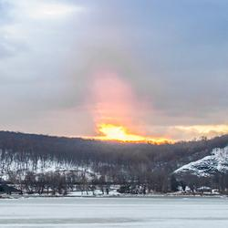
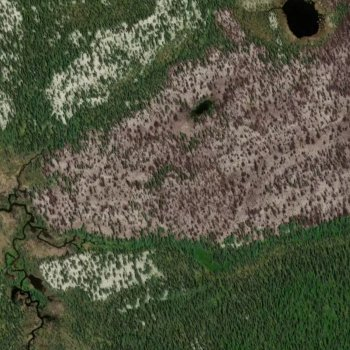
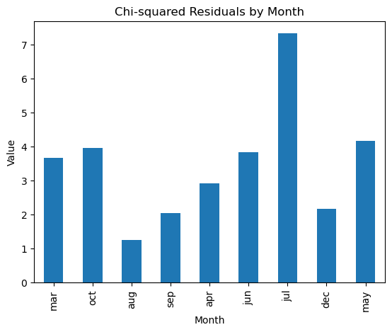
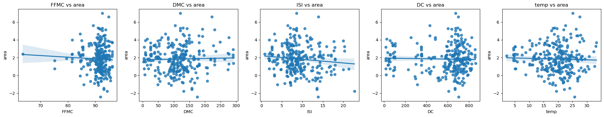

# DataSciForestFires
An analysis project of which factors best predict the spread of forest fires using data from Portugal and California.

This is a data analysis project that branched from my ap stats project which I am submitting for Shipwrecked! I chose to study different approaches to predicting whether fires will occur and the extent of the damages. I broke the project into 3 smaller components. See the end for few instructions on project setup.

-----
## SETUP
To enable you to interact with the project yourself, I began developing an electron app which will load the model weights and allow you to use them. The data analysis and app deployment for this project are still incompete but steadily approaching the end.

files folder: https://drive.google.com/drive/folders/1_-aa13E9cMbITtSrOPwRTBYnCwgR9u7Z?usp=sharing
files explanation: https://docs.google.com/document/d/1jI2lNCgOUgvdx8HeDe8DR9JT9CB5ej2cJ7bPGN6Y8pI/edit?usp=sharing

##### [NOT RECOMMENDED] PACKAGED APP:
Download your app version zip and unzip. This is the application, ready to run. 

I have the packaged application available for Mac, Windows and Linux. I have only tested Mac. I highly recommend the repository option instead because it is much faster. Additionally your device will not recognize the security and safety of this packaged application, and you will have to bypass. Please note that the packaged version will take a long time to verify and run, and initially it freezes when uploading images.

##### [RECOMMENDED] INSTRUCTIONS TO SETUP ENV AND REPO:
Download heavy zip and unzip the folder into my-electron-folder. All necessary assets are now accessible.

To use the app, please download this repository to your local computer. Download and move these zips ("DATASETS" and "heavy_zip") to the my-electron-app folder, then expand them. These hold the models and datasets. Without these files, the app and notebooks will not work properly. These files are too large to be transmitted through Github without warning.

To run the electron app:
```bash
cd your-folder-name
/opt/homebrew/bin/python3.11 -m venv venv
source venv/bin/activate

pip install --upgrade pip
pip install -r requirements.txt

npm init -y
npm install
npm start
```

This project is also a submission to a challenge called Shipwrecked which I am very inspired by. Thank you for your support. - Dristi Roy

----
### FEATURE 1
Classifies your home into one of three fire damage risk categories.

Process:
With a dataset of fires from California in the past decade, I setup a regression model to predict one aspect of the damages given the other. The dataset includes a vast number of quantifiable potential damages: Area_Burned (Acres), Homes_Destroyed, Businesses_Destroyed, Vehicles_Damaged, Injuries, Fatalities, and Estimated_Financial_Loss (Million $). Given values for one damage, the model can estimate the value for a specified target factor. I used scikit for the regression model. Because users will not always have all the values available to them, I included the imputer to substitute the mean value for the factor instead. The regression model will be available for interaction upon the completion of my electron app.

- DATASET LINK: https://www.kaggle.com/datasets/vivekattri/california-wildfire-damage-2014-feb2025/code
- Reference to data: "DATASETS/California Wildfire Damage.csv"
- Filenames: notebooks -> "COST_analyze.ipynb"

Unable to establish any strong correlation between these features, I looked to a different dataset with a wider variety of points to predict damage based on other factors available. There was more success here. Rather than surrounding the factors DURING the fire, a classification model demonstrated better success at categorizing houses into one of 3 risk levels with an accuracy of 93.2%.

- DATASET LINK: https://www.kaggle.com/datasets/vijayveersingh/the-california-wildfire-data
- Reference to data: "DATASETS/thecaldataset/damagepred.csv"
- Filenames: notebooks -> "BEFORECOST_analyze.ipynb"

-----
### FEATURE 2

Due to the unreliability of prediction methods 1 and 2, I wanted to train ResNet18 to identify fires from both satellite and regular images. I predict the regular images will be much easier to predict from due to being closer to the scene but satellite data would be more practical for early identification and I would like to see the extent of the difference between the two image types. As of the last training stage, the model has achieved 85% accuracy for classifying satellite image data and 90% accuracy for classifying normal data as fire/no fire.

<p align="center">
  
  
</p>

- DATASET LINK: https://www.kaggle.com/datasets/brsdincer/wildfire-detection-image-data
- DATASET LINK: https://www.kaggle.com/datasets/abdelghaniaaba/wildfire-prediction-dataset
- Reference to data: "DATASETS/arch2DS/train", "DATASETS/arch2DS/test", "DATASETS/arch2DS/valid"
- Filenames: notebooks -> "IMG_SAT.ipynb"

-----
### FEATURE 3
Early statistical analysis.

Process:
Using a dataset of forest fires from Portugal, I conducted a X^2 GOF test on the average area burned from the fires versus the month when the fires occured. I expected that the fire area burnt would more strongly correlate with summer months but upon removing 0 values and months with too little data, I found that there was no predictable progression for when the fires occured.

<p align="center">
  
</p>

With the same dataset, I also wanted to test the true relevance of the Canada Fire Indices -- FFMC DMC ISI DC -- given in the csv. ISI (initial spread index) was the index we hypothesized would be most intuitively correlated to the fire area, and we were correct. However, the indexes all provided very little value in terms of prediction capability due to the correlation coefficients being very low.

<p align="center">
  
</p>

- DATASET LINK: https://www.kaggle.com/datasets/sumitm004/forest-fire-area
- Reference to data: "DATASETS/forestfires.csv"
- Filenames: notebooks -> "GOFTEST.ipynb", "CORRELATE.ipynb"