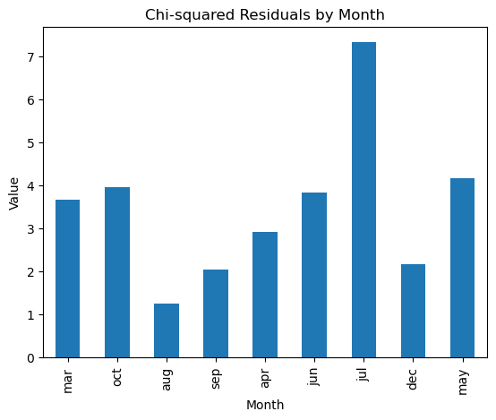

# DataSciForestFires
An analysis of which factors best predict the spread of forest fires using data from Portugal and California.

This is a data analysis project for my statistics capstone project. I chose to study different approaches to predicting whether fires will occur and the extent of the damages. I broke the project into 3 smaller components. See the end for few instructions on project setup.

-----

1.
With a dataset of fires from California in the past decade, I setup a regression model to predict one aspect of the damages given the other. The dataset includes a vast number of quantifiable potential damages: Area_Burned (Acres), Homes_Destroyed, Businesses_Destroyed, Vehicles_Damaged, Injuries, Fatalities, and Estimated_Financial_Loss (Million $). Given values for one damage, the model can estimate the value for a specified target factor. I used scikit for the regression model. Because users will not always have all the values available to them, I included the imputer to substitute the mean value for the factor instead. The regression model will be available for interaction upon the completion of my electron app.

- DATASET LINK: https://www.kaggle.com/datasets/vivekattri/california-wildfire-damage-2014-feb2025/code
- Filenames: notebooks -> "COST_analyze.ipynb"

-----

2.
Using a dataset of forest fires from Portugal, I conducted a X^2 GOF test on the average area burned from the fires versus the month when the fires occured. I expected that the fire area burnt would more strongly correlate with summer months but upon removing 0 values and months with too little data, I found that there was no predictable progression for when the fires occured.

With the same dataset, I also wanted to test the true relevance of the Canada Fire Indices -- FFMC DMC ISI DC -- given in the csv. ISI (initial spread index) was the index we hypothesized would be most intuitively correlated to the fire area, and we were correct. However, the indexes all provided very little value in terms of prediction capability due to the correlation coefficients being very low.

- DATASET LINK: https://www.kaggle.com/datasets/sumitm004/forest-fire-area
- Filenames: notebooks -> "GOFTEST.ipynb", "CORRELATE.ipynb"

-----

3.
This part of my project is still in early development but due to the unreliability of prediction methods 1 and 2, I wanted to train ResNet50 to identify fires from both satellite and regular images. I predict the regular images will be much easier to predict from due to being closer to the scene but satellite data would be more practical for early identification and I would like to see the extent of the difference between the two image types. As of the last training stage, the model has achieved 85% accuracy for reading satellite image data.

- DATASET LINK: https://www.kaggle.com/datasets/brsdincer/wildfire-detection-image-data
- DATASET LINK: https://www.kaggle.com/datasets/abdelghaniaaba/wildfire-prediction-dataset
- Filenames: notebooks -> "IMG_SAT.ipynb"

-----

To enable you to interact with the project yourself, I began developing an electron app which will load the model weights and allow you to use them. The data analysis and app deployment for this project are still incompete but steadily approaching the end.

The notebooks will not run unless the dataset links given in this readme file are uploaded to the DATASETS folder. To run the electron app at this moment you must setup node on your local computer (unadvisable) but a better deployed version will be available soon. The figures for this project are placed in the figures folder and the notebooks with which I ran these tests are within the notebooks folder.

To setup the electron app:
cd your-folder-name
npm init -y / npm install
npm start

This project is also a submission to a challenge called Shipwrecked which I am very inspired by. Thank you for your support. - Dristi Roy